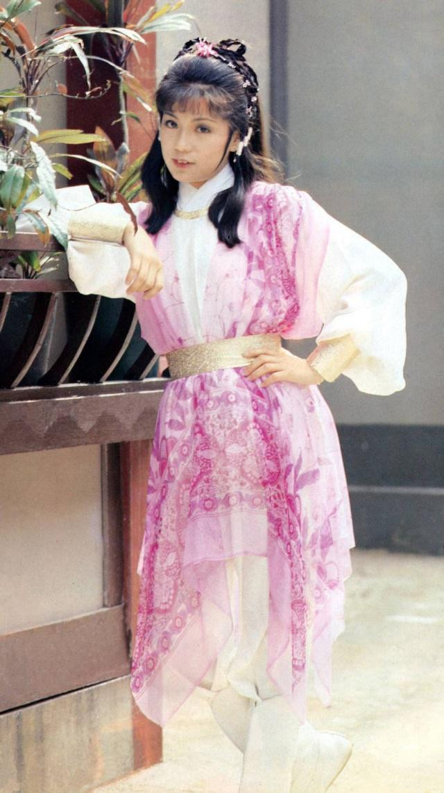
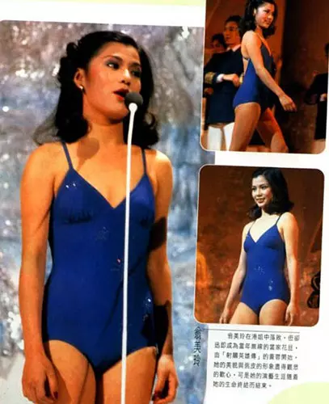
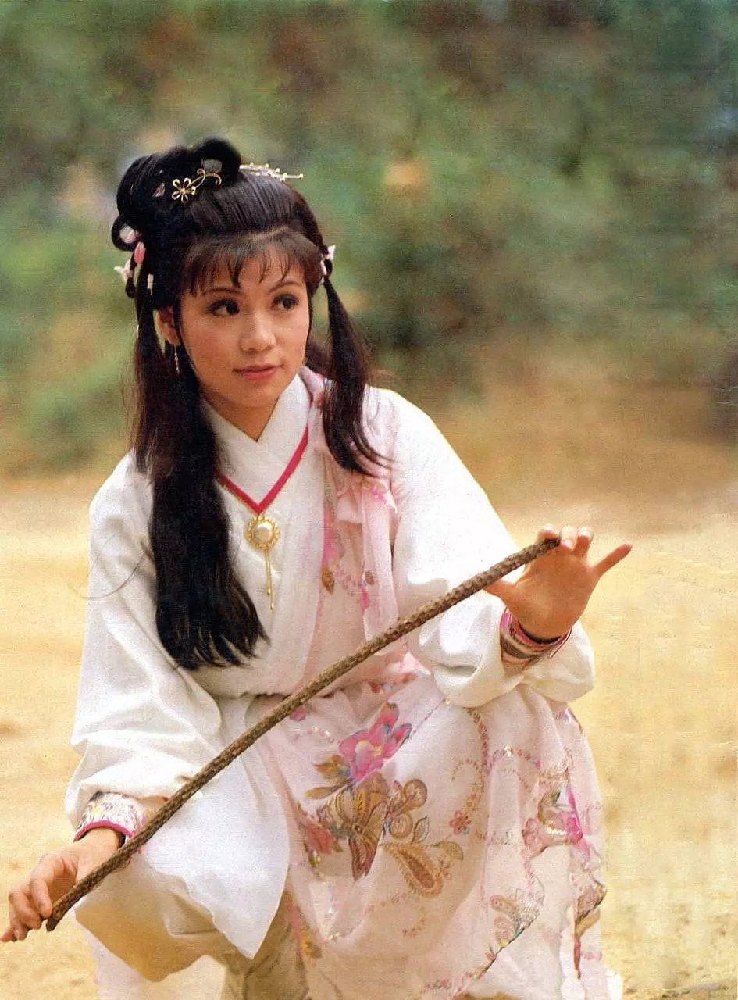
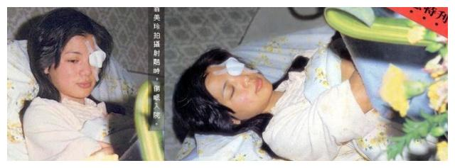
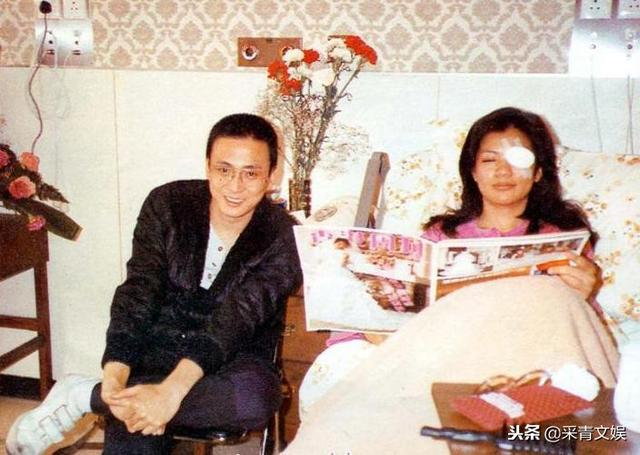
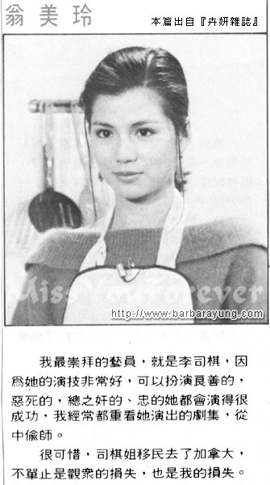

 

    翁美玲初接“黄蓉”一角之时，她曾经写过一篇文章，在文章开头她这样写着：“人生如舞
    台”犹如我当日走上那个选美台上，正如今日我出现在这个舞台上，一切都令我自己难于置
    信，既然踏上了，我只有挺起胸膛向前大步地前进，再不容许自己犹疑或徘徊.....。”

 

港姐落选无疑有小小失望，相信是正常的感受，有谁会因失败而喜悦呢？ 但从而认识了很多东西，亦因而进入了电视圈，初时是感到很新奇、剌激。渐渐知悉这道门可不是容易闯过的。

虽然我曾经因恐怕做得不好而灰心过、愤怒过、哭泣过。但仍不断在努力、在学习、在适应，唯求能够真正投入。我是个很安命和自量的人，记得知悉可以演出“十三妹”一剧时，便已经很满足了，初时多么害怕自己做不来、或做得不好，但这些都是必经的路程，凡事必定有第一次，我用了全部的勇气去接受这个挑战。

-------

 

幸运之神的确很疼我，连做梦也没想过的“黄蓉”竟然也落在我身上。当然我有为之而惊喜过，随即我更感到面前的挑战越来越难倒我。

可是我不能退缩、不能畏惧、更不能失败，换言之，我要全力以赴去做好这个黄蓉。一个像我演技尚嫩、武打不精的人去做这角色，真是谈何容易？加上听说米雪姐姐当年的确把黄蓉演得维肖维妙，故难免令观众将来会把我和她相比，内心的压力便更大了。

虽自己未曾看过昔日的“射雕”，但米雪姐姐的精湛演技我可看过，那么今日我该怎样去演好黄蓉呢？只有六个字“勇气、努力、尽心”，就凭这六个字去演我心目中的黄蓉。

-------

 

“射雕”的片集既然未看过，我必定要看原著去知悉剧情和人物的发展，使自己深入了解黄蓉究竟是怎样的一个女孩，无疑我爱上了这个故事，但黄蓉却把我考倒了。

因为金庸先生笔下的“黄蓉”的确精采，以一个十五岁的女孩子来说。她实在太精灵、太专情、太可爱了。但另一面的她却太自私、太阴邪、太任性了，正是百感交集于一身。所以在黄蓉这个角色中我能有机会去演出多方面的性格，是非常考验自己的，虽然我用心做好，可是仍恐怕自己的表现未能如理想。

记得当日演“十三妹”时的心情是轻松得很，但今次却处处对自己的表现感到不满，可能是对自己的要求也提高了。

很多时我会因做得不好而不能入睡、或连做梦也忘不了某场的表现。我真的没有夸大自己的感受，相信这都是因为我的经验有限才有这种心理上的压力吧！

--------

 

至于武打方面，对我来说又是另一个挑战，习武是非一朝一夕有成1983 射雕的，所以武术指导程小东的确要费很多心思使我这个门外汉成为一个侠女，初时对于舞刀弄剑，多少有点心怯，总感到手脚不能合一，正是顾得打来又顾不了表情，因为舞起刀来是需要敏捷和有节奏感，加上和对手要配合好才成。有时真不相信自己会打人打得那么狠和能够面对进招的武器。又如遇上要从十多尺高的高楼或大树跳下来，整个人在廿多尺高空吊来吊去、又或者要在水底一战，这些动作都是首次亲身体验到，勇气的确帮了我不少忙，起初就凭这股勇气，一切都很顺利。

直到有一场我一人对三人打的戏中，因和节奏配合不当，一不留神竟被对方兵器划破了自己的左眼。记得当时很本能地紧掩著左眼，强忍看泪水，可是已感到隐隐作痛，在惊慌的情绪之下，血水和泪珠便如黄豆般的滚下来，再也忍不住了。

--------

 

相信当场很混乱，耳边听了很多安慰的话，便感到自己的身体被抱上一架车，这时反而心情由惊慌渐渐变为冷静。

告诉自己：“根本不会有事的，小痛不忍，大事不成！”

当医生说要缝五针的时候，这五针简直像要缝在我的心上一样。内心的徬徨、辛酸再也掩不住了，身边每一个人所说的慰言都是那么亲切，啊！“妈妈，妳不能知道这件事的！”

我出奇地很乐天，迫不及待要看看纱布下的五针是怎样地难看，我以最坏的念头去接受这件事的发生，我恨害怕自己从此破相，怎样也不能破相！还有四十集的“射雕”未完成，我真是死也不甘心，所以当时的心情是非常激动和矛盾，无疑我为工作担心多于自己，总觉得若因此事而不能演下去的话，可说是前功尽弃，虽然我未必演得出色，但我努力过，挣扎过。谢天谢地，除了左眼双眼皮更深之外无恙，很多人以为我从此对武打会有戒心和畏惧，不知那里来的勇气，我却因而不怯。很多人对我很关心，心领得很，他们的友情使我充满信心。

当然在这个圈子里，有人喜欢你，必定有人不喜欢你。所以不时都在报章杂志上看到些有关自己的事，看到有鼓励和批评的时候便很乐意接受，希望知道自己的短处后从而做得更好。

-------

 

但当听到有中伤之言的时候，便很奇怪，为何他们要这样对我？难道伤了我的自尊他们会很快慰的吗？做黄蓉是公司派演的，我只是尽责，尽本能地演好它。精神的负荷、内心的压力、体力的支付，这一切都是我的付出，相信每一位演员都是这样的，为何要挖苦我的努力呢？

最近还看到有报章杂志说我常发脾气，未红先骄之语。初时真是为之气结，虽然知道说我者之心何在，但不免觉得小人之心不可不防，试问自己才初初出道，何来未红先骄，况且圈中很多人都很照顾和指导我。如秀姑．曾江．琳琳姐．任达华等，他们真是和蔼可亲，不时启发我，使我有如生活在一个大家庭中作得非常愉快。就算遇到不愉快或做到烦的时候，也会克制自己的情绪，但人的容忍是有限度的，当被对方冷言冷语的话，那口气真难下，没想到一次不忍，便就被人中伤，想来，实在是无奈得很。

-----

 

 

短短由“妇女新姿”至今八个多月中，我学识了很多很多事物。

虽然我有惆怅和不愉快，但其中的确有说不尽的乐趣和欣悦，无疑我很幸运，有个很好的开始但愿我懂得珍惜这个开始不惜努力去学习去适应一切。

只要我没有使大家失望便觉得自己的付出是很值得，而望能换来更多的支持．鼓励和批评，好使我更为之加一股劲。