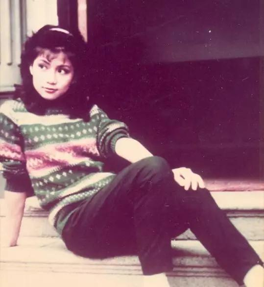

 

 

我没有后悔自己的选择，反之，我会继续努力工作下去，让这个“浪花”溅得更灿烂。终于提起勇气和希望离开那可爱的英国，尤如八年前我离开香港，是一个抉择。八年了，无疑自己已适应那边的生活，清淡、安逸，像艘停泊在无波无浪小湖中的一只小船。或许停泊得太久。我要闯出这个小湖，看看小湖外的天地，我愿向一些浪花挑战！

记得初回港时那份心情特别兴奋，因为一切都意味着新鲜和刺激，对我来说，这是一种无可抗拒的诱惑。我告诉自己这是你的选择，我甘心放弃那份安逸来迎接这个挑战。在我返港后的这四个月来，每天不停在转变、不停的接受，我简直无法安宁下来。

从选港姐至今踏入无线上作，每一刻都是那么紧张，简直使我喘不过气来。无线参选港姐是给予自己一个很好的学习和适应机会，虽然没有获得任何头衔，但我已得到最宝贵的两样东西～从中吸取到很多经验和认识很多新朋友，这些对我来说相信会比较重要和需要。

我竟然幸运地能进入无线工作，当初无线邀我演出时，我曾经犹豫不决过，因为辛辛苦苦在英国读完纺织设计回来，如果加入无线工作，岂不是学非所用，白白浪费了这辛苦多年的成果？不过，几经考虑后，我还是决定尝试演出电视。立即便引起很多人奇怪，为什么我会入无线？

世事很多时就是“无心插柳柳成荫”的，但愿我的另一次抉择是对的！ “妇女新姿”是我的第一份工作，当然要好好地珍惜它，更想尽量把它做好，可惜力不从心，因为离开香港实在太久了，对很多事物都感到陌生，加上广东话咬字发音也变得不大准确，故多多少少也会影响表现。如今祇有希望随着时间的练习和努力会有所改进。幸而公司上下的同事、朋友都给予我无限的帮助和鼓励，工作得也非常开心，更希望观众能谅解我的短处，给我一个学习的时间和机会！ 

我期望过、欢笑过，我也失落过、辛酸过……很多时，无论遇上了新朋或旧友都会自自然然问及我来港后的感受，一个听来多么切身的问题，奈何却感到如此难于解答呢？可能如今的感受与当日到港时，真是有些不同！

正所谓触景可以伤情，故内心的情绪每每会因周围的环境、朋友、事物以致有所感触。记得当日踏出机场的步伐是如许的兴奋和自信。景物是新奇的、喧声是热闹的、阳光是温和的。

八年前的一切又出现于眼前了，那些都是自己十分怀念的，那刻但愿所有人知道我多么欣喜。也不会去想那日后的日子和遭遇是怎样的？

现在，我要把多年来的平淡生活置于脑后而去重投那繁华的－香港！虽然短短四个月中，已尝尽喜怒哀乐的滋味，我期望过、兴奋过、欢笑过。相对地，我也失落过、徬徨过、辛酸过。

我相信命运的安排，而人生路上的起伏，可用作磨练自己的，可以使我们更加成熟，所以我不能没有这些生命的花絮。有人乐极生悲，亦有人苦中作乐，甚至有人笑中有泪，这一切一切的悲与乐是视乎个人感受的表现，虽然每个人都有权保留自己内心的秘密，但有时自己不知不觉中会表露无遗。换上了自己，或者还可以吐吐心声，可是当无援的时候，那种孤寂和失落的感受真是苦不堪言。我更奇怪自己，为何对这儿的一切竟是如此的陌生？

我有如一个开始学行的婴儿般，在摸索的前进，在寻找扶持我的人儿，在了解周遭环境，多么可怕的开始！尽管人类是最能适应环境的，但每一次的开始或转变都一定会带来无限的困扰和徬徨，抬起头来吧！要尽自己的本能去刻服一切的挑战，但愿我是个幸运儿，会遇到那扶持我的人儿，告诉你呀！我已遥望到那广阔的前路了！