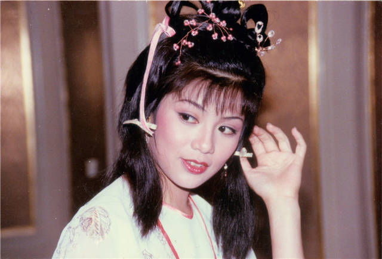

 

 

 
我读中学的时候，住在英国，住了这许多年，客处异乡的感受我很清楚。虽然，妈妈一直住在那边，已经是落籍的了。而我与她相依为命，英国也就是我的另一个家，但我仍要用这个“客”字，因为那始终是一个外国人的国度，当周围的人都是红须绿眼，满口“鬼”话，而自己依然是黑头发、黄皮肤，实在产生不出归属感，更遑论投入！

不过在返港初期，我的心情也是战战兢兢的。在英国起码有妈妈在身旁，为我打点一切，甚至可让我发发脾气，使一下小性子，而且那是一个熟悉的环境，无论我投入与否，熟悉的东西总不会带来恐惧惑。但回到香港之后，这个我曾居住的地方反成陌生之地，一切需从头开始。

起初，我给自己定了两年「试验期」，在这段期间，好歹也要让自己在这里闯一闯。参加港姐竞选，其实也是闯一闯这脾气在作祟，我想人生贵在左一为阿翁选美时的样子尝试，入选与否反在其次。

起初，我给自己定了两年“试验期”，在这段期间，好歹也要让自己在这里闯一闯。参加港姐竞选，其实也是闯一闯这脾气在作祟，我想人生贵在左一为阿翁选美时的样子尝试，入选与否反在其次。

成为十五名入选港姐之一，被无线邀请作为“妇女新姿”的主持人，也坚定了我要留港发展的念头，反正两年的限期未过，我已得到不少可贵的经验、实在也乐于继续尝试，直至成为黄蓉，我知道我是不能毅然只身回英国去的，因为在香港我已有自己的事情，自己的朋友及一套属于自己的生活方式。

我的生活方式其实也与我的职业和朋友息息相关。本来我从没梦想自己会成为明星，更加想不到干电视这行原来是这样子的。

晨昏颠倒，日以继夜的工作程序（如果这仍算是程序的话），本是手无搏鸡之力，却要舞刀弄枪变成江湖侠女等等，工余之后又要出席很多招待会宴会之类，面对不同阶层的人，最要命的就是必须发辉强大的忍耐力和抑制力去对抗那些耸人听闻的煲水新闻，所以在我的生活里没有上、下班时间，没有固定的日常工作，甚至没有固定的薪酬，但我喜欢这种生活方式。

这是一种体力透支的生活，但却多姿多采。香港的可爱就在于它容许这种多姿多采的存在，香港人孜孜不倦的工作，同时也懂得投入生活去共同制造一个五色璀灿的社会，看见香港现在的建设，与我十几年前在这里所见的，相距又何止千里。

我相信在所谓“前途阴影”之下，香港仍会继续繁荣的，也许，这祇是我一厢情愿的期望吧，不过也不用我们多想，尽力做好自己本份就是了。