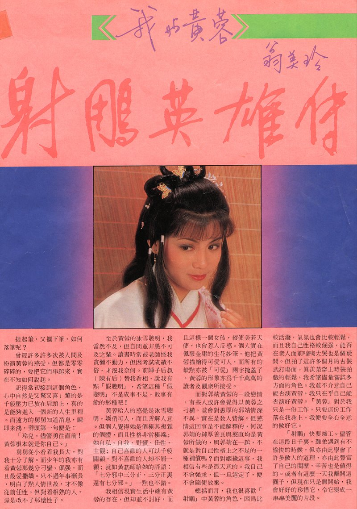

我是黄蓉
=======

## 原图

## 文字

提起笔，又搁下笔，如何落笔呢？

曾经许多许多次被人问及扮演黄蓉的感受，但都是零零碎碎的，要把它们串起来，实在不知如何说起。

记得当初接到这个角色，心中自然是又惊又喜；惊的是千般压力已放在肩头上，喜的是能够进入一个新的人生里程。而远方的舅舅知道消息，瞬即来鸿，劈头第一句便是：

    「玲儿，尽管勇往直前！黄蓉根本就是你自己。」

舅舅从小看着我长大，对我十分了解。而少年的我亦有着黄蓉那几分刁蛮、倔强，而且最爱撒娇。只不过年事惭长，明白了点人情事故，才不像从前任性，但对着相熟的人，还是改不了那坏性子。

至于黄蓉的冰雪聪明，我当然不及，但自问并非愚不可及之辈。读书时常被老师怪我贪懒不勤力，但因考试成绩不俗，才没我奈何。前阵子后叔（陈有后）替我看相，说我有点「假聪明」，希望这种「假聪明」不是成事不足，败事有馀的那种吧！

黄蓉给人的感觉是冰雪聪明，娇俏可人，而且善解人意。但个人觉得她是个极其复杂的个体，而且性格非常极端；她自私、自我、野蛮、任性、主观；自己喜欢的人可以千般关顾，对不喜欢的人却不屑一顾；就如黄药师给她的评语：

    「七分邪中三分正，三分正里还有七分邪。」

一点也不错。

我相信现实生活中确有黄蓉的存在，但却并不讨好，而这样一个女孩，纵使美若天使，也会惹人反感。个人实在佩服金庸的生花妙笔，他把黄蓉描绘得可爱可人，所有的缺点亦被「可爱」两字掩盖了，黄蓉的形象亦为千千万万的读者及观众所接受。

而对郭靖黄蓉的一段恋情，有些人或许会觉得以黄蓉之刁横，竟会对愚厚的郭靖情深不异，实在是教人费解。但感情这回事是不能解释的，何况郭靖的纯厚善良与憨直均是黄蓉所缺的，与郭靖在一起，不就是对自己性格上之不足的一种补偿吗? 而对姻缘这事，我相信有些是凭天意的。我自己不会强求，但一旦选定了，便不会随便放弃。

总括而言，我也很喜欢「射雕」中黄蓉的角色，因为比较活泼，气氛也会比较轻松，而且我自己性格较倔强，能否在众人面前嚎啕大哭也是个疑问。但拍了这许多个月的古装武打场面，真羡慕穿上时装拍戏的轻松，我希望尽量尝试多方面的角色。我并不介意自己能否演黄蓉，我只在乎自己能否演好黄蓉。「黄蓉」对于我只是一份工作，只要这份工作落在我身上，我便要全心全意的做好它。

「射雕」快要竣工。尽管在这段日子里，难免遇到有不愉快的时候，但亦由此学会了许多做人的道理，亦由此丰富了自己的阅历，辛苦也是值得的。或者有这么一天我离开这圈子，但现在只是个开始，我会好好的珍惜它，令它变成一串串美丽的片段。