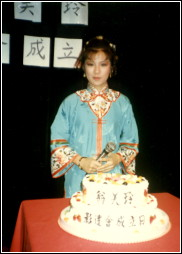

 

 

真不敢相信，我居然也组织起影迷会来。

我这平凡无奇的女孩．实在难以明白怎么会有人“迷”。说真的，我一向做梦也不敢想像搞什么影迷会，一来是当之有愧，二来是怕被人误会“招摇”。

一个初出茅庐的丫头，学什么人家做偶像啊？

不过，喜欢我的小妹妹们的确太热情了。她们可以在电视台门口苦候半天，等的不过是见一见你，请你给她们签一签名。他们又有心思把杂志上你的所有照片通通剪下来，隆而重之地用相簿整整齐齐的贴好，简直就是你的一本私人纪录！她们还可以午夜待你收工回家，然后摇个电话给你，你当晚的电视剧演得很好。

这一年来，与这些朋友不断的通信、见面、电话聊天，感情也就这样种下了。渐渐，我不再当他们是我的影迷，而把他们看成一群认识我欣赏我的新朋友。最后，我还是被他们的热情感动了，点头同意组织影迷会。只是，我始终不希望他们把看成什么偶像，我只愿意做他们的好明友，每年搞几个活动聚一聚，欢乐一下就够了。对于跟无线签约五年之事，不少朋友都表示吃惊，大叫有无搞错。不错，五年时间确是段不短的日子，我也曾作出个慎重的考虑。

既然公司开给我的条件不错，而且又是公司主动提出的，要我拒绝总有点为难。于是也就毅然动笔，安心再留在视圈经历另外一个多姿多采的五年。

其实，我盼望拍电影盼了好久，而亦有不少片商斟我拍戏，只是全都被公司拒绝了。当然，这是出于好意，其一公司担心档期有冲突，其二公司要严格选择剧本，为恐有损形象。我也同意这出发点，所以也一直在乖乖的等待哩。