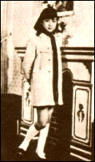

 

    以下为七三至七四年间的翁美玲从香港寄给其在英母亲的家信笔迹。均是航空邮柬。信中显
    露出翁女爱母之心及对生命充满著斗志。

 

敬爱的棠叔和母亲：

自上次来的录音至今，未见音讯，早而为之焦急和盼望，本想去信问之，可是数星期来多样的测验，令我措手不及，难于应付。直至昨夜三时许，忽闻母亲来电，本该欢欣才是，可是一听其音，便为之心寒，知道母亲必定有事而使妳焦操不安，但当时之突然实使我不知如何慰问，故只有希望立刻写此封信，一问其原因和劝母亲凡事都要看开，在这个人吃人的社会，有时实在是防不胜防，只要自己做事心安理得和能临危不乱才能应付，所以母亲妳亦无需与那些奸狡的小人作对，正所谓善恶到头终有报，我才不相信我们会被人欺负到底的，故倒不如吃亏一次算了，我们有的是劳力和勤奋，可以从头再来。此外，最重要的还是要保重自己的身体。尤其母亲妳，是不能激气的，因为这样会很伤身体的，那又何必呢？

我们每人每日都是在祝福妳的快乐和健康，相信人有善愿，天必助之。而妳亦无需忧心我们，因为我们会自我照顾和打理家事，家中一切都平安无事，冯太和代母一有空都来探我们，而也必定问及你的近况，我都替你一一答谢她们了。母亲，我也曾说过，无论什么事情发生，你都不可以与棠叔闹意见，因为你是需要有人与你共商共量和照顾你的，所以希望你能平息忧虑，早日过著无愁而开心的生活，那我们便欢欣了，好了，请代问候棠叔叔，说我下次才与他相谈。

祝　生活愉快，身体健康！

    女儿　囡囡上
    From Barbara
    七三年十月六日