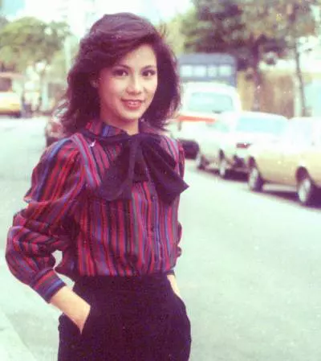

 

 

亲爱的舅舅：

你的来信和相片都收到了，首先请你不要再怪那篇稿，好吗？说真的，当初我一点也没有意料到是会令你不开心的，过去的已过去，以前幼稚的我可能怪错你，但现在都大了，当然不再记什么，记只是记那段故事而已，何况这么多年你一直照顾着我们，难道我不尊重你对我的疼爱吗？请不要为这些小事而怪我啊！只可怪我无心之失，望能原谅，你仍然是那可爱的舅舅！我这一生也不能找到第二个像你的舅舅！	

相片中的妈咪很“风骚”，嘻嘻，我的朋友都说她只像四十来岁，但舅舅看来有些倦意，相信是辛苦了，希望你要多多休息，又要提起Shela来，你们究竟怎样的？她曾来信，请代问候，我也会回信问安，信中也提及你们辛苦和惦念之情等等，此外，家中的动物真可爱，是一些在香港找不到的乐趣和可爱，看见真令人“肉紧”。

父亲有来信还寄些钱来，我说过不要寄钱了，其不知怎样说谢呢？他还说出年和母亲一起回来一行。

总之，舅舅你一定要多的休息，请勿为我操心，我会小心和不会再犯错了，祝安康！

    囡囡
    八二年十月十九日