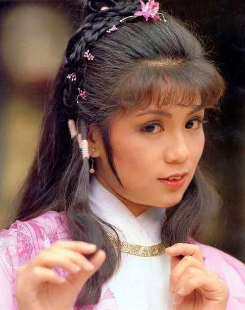

 

 

亲爱的妈咪、舅舅：

人的命运真不是自己可以作主的，怎也不相信目前的一切，只有说运气令每件事都事半功倍，我已决定被派演黄蓉一角了，可说是乍惊乍喜，一时难以置信。圈中很多人都喜欢我，所以说我是众望所归。但另一方面，当然引起很多羡慕和不满的小心眼人，因为自问凭著自己是新人一名，和演出的日子尚浅，未到半年竟有如此厚侍。新约人工底薪加到三千五，一年一百二十镜以后的便补薪三百五十一个镜，入了话剧组真是不用愁没镜补了，但相信不到半年会再加薪的。至于约期是五年，本想只签三年，但公司说他们有个五年计划的，所以为这次的机会，我便签了。正所谓，机会只有一次，现在怕的只怕自己的演出。

‘射鹏’待我演完‘十三妹’便有我戏了，故我真是忙得很，现‘十三妹’我也有工作通宵达旦之苦，何妨黄蓉呢？不过，我真是很满意近况。

朋友亚声会带给你们一对耳环给妈咪的，两件冷衫是舅的，一件是父亲的，代母有送床单一套等等，希望收到后告知我，尤其妈咪的耳环，因为我答应过赚到钱一定买给你的。虽然现在暂时未大发，总可聊表心意，相信你一定喜欢的。现在英国开始冻未？香港已渐凉了，你们可要注重身体啊！很快又到了年尾，相信生意也忙，一切可要小心，不要太操劳或担心我，我会处处小心了。

可以的话，请尽快寄六张我童年相（比喻由少年至十岁的相），因周刊要写我，要些童年照，当然他们影后会还给我的，故请用快邮，我是急要的，日后将会看到我很多相登的（除了明报比较少），所以很难把所有的寄来，因为唐人街也该可以买到的，好了，下次再谈吧！

    囡囡　上

（编者按：此信没有日期，大约是在八三年接拍《射雕》期间）