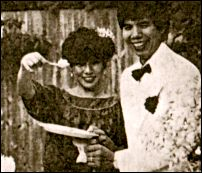

 

 参加舅父的婚礼，与舅父合照
 

亲爱的父亲、妈咪、舅舅：

很久没有写信了，因工作实在忙，近日因眼伤才有机会歇一下，亚妹比妈咪好运些了，起码我可以陪她到处玩，她买了很多东西，我托她带了一本画簿、丝巾和皮褛，全是舅舅的（生日礼物），至于妈咪的耳环已托父亲带予，所以今次只买少少东西给妈咪，待我回英渡假时再买你要的珠戒指给你配成一套，好吗？

上两星期我曾和亚妹去黄大仙还神，又去一个和尚处睇相，看来不俗，待亚妹回来时告知你们那和尚说什么，要是真灵的话，那就一天都光晒，现在我都不敢多说，要到一切如愿时才发威，亚舅，不知该否要向你道贺，那和尚竟说你和亚妹是夫妻相，唉，你真是不知是福是吉了，但愿你心知该怎样处理便好，你们的八字是配的，那你会怎办呢？希望趁我回英时可以饮到你的喜酒，亚妹总算守得云开见月明，现在一切看你的了，不妨向我说明真相呀！正所谓不对我说向谁说会比我更清楚你！遥祝你一切如意。

《射雕》已播，我在第九集才出场，头二十集《铁血丹心》已拍完，现赶第二段《东邪西毒》和第三段《华山论剑》，相信要到六月尾才拍完，希望一切顺利，自己一直在担心自己的表现，因为米雪的“先入为主”，无疑人人会拿我来比。当然我已准备接受一切的批评，香港人是十分挑剔的，近日XXX竟在背后中伤我，说我“未红先骄”来破坏我的形象，她真少气，可是我也无奈。无疑，我已尽力而为去做好，这表现实非一朝一夕能进步千里。有人找我拍电影，但因撞期而不能接，一切都是身不由己，但我会小心的，请不要挂念。

妈咪、舅舅，你们可要自己保重啊！不要太操心，一有假我便回来见你们，父亲来时自己也忙，只能和他饮下茶，并没有送机，望他见谅，亚汤亦买了东西给妈咪，他叫我代问候你们，好了，多休息啊！

    挂念女儿　囡囡上
    八三年三月十三日

