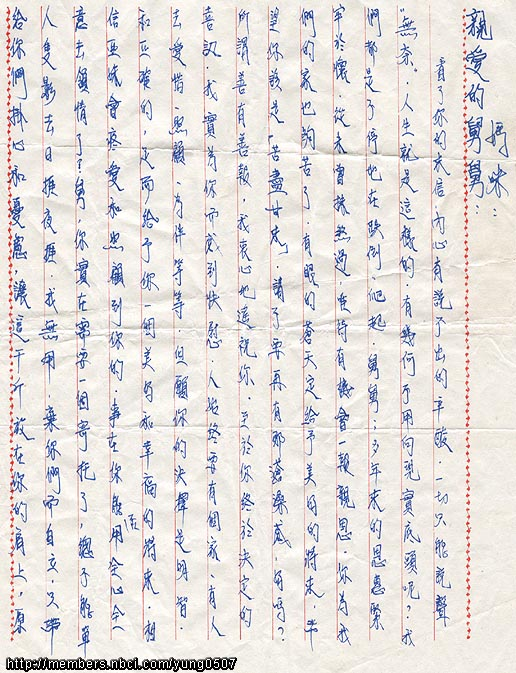
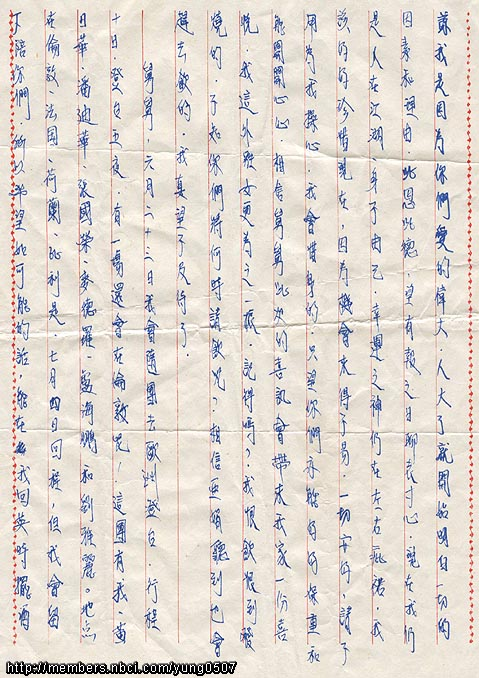
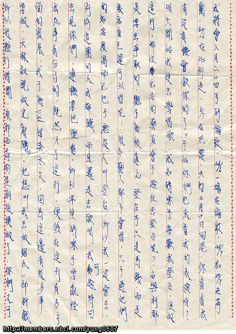
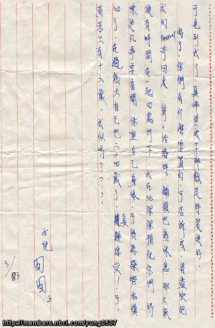

这封信和照片是2001-5月中阿翁的小表弟Andrew寄给loulan与大家分享的。
信的内容：

    Hi, my parents say that this pic was taken on their wedding day.
    It was never released to the public so it is quite special.
    I'm also sending some letters.

## 文字

  

 这张照片是Barbara在舅舅婚礼上影下留念
 

亲爱的妈咪、舅舅：

看了你的来信，内心有说不出的辛酸，一切只能说声"无奈"，人生就是这样的，有几何不用向现实低头呢？我们都是不停地在跌倒、爬起，舅舅，多年来的恩惠紧牢于怀，从未曾抹煞过，唯待有机会一报亲恩，你为我们的家也够苦了，有眼的苍天定给予美好的将来，希望你该是“苦尽甘来”，请不要再有那苍桑感，好吗？
所谓善有善报，我衷心地遥祝你，至于你终于决定的喜讯，我实为你而快慰，人始终要有个家，有人去爱惜、照顾、为伴等等，但愿你的决择是明智和正确的，足而给予你一个美好和幸福的将来，相信亚妹会疼爱和照顾到你的，事在你能否用全心全意去领情了？

舅，你实在需要一个寄托了，总不能单人只影去日挨夜挨，我无用，弃你们而自立，只带给你们挂心和忧虑，让这千斤放在你们的肩上，原谅我是因为你们爱的伟大，人大了就开始明白一切的因素和理因，兆恩兆德，望有报之日聊表寸心，现在我仍人在江湖、身不由己，幸运之神仍在左右疪佑，我该好好珍惜现在，因为机会来得不易，一切安好，请不用为我操心，我会惜身的，只望你们亦能好好保重和能开开心心，相信舅舅此次的喜讯会带来我家一份喜悦，我这外甥女更为之一振，记得吗？我恨饮恨到发烧的，不知你们将何时请饮呢？相信亚娟听到也会赶去饮的，我真望不及待了。

舅舅，六月二十三日我会随团去欧洲登台，行程十日，登台五夜，有一场还会在伦敦呢！这团有我、黄日华、潘迪华、张国荣、麦德罗、卢海鹏和刘雅丽。地点在伦敦、法国、荷兰、比利时，七月四日回程，但我会留下陪你们，所以希望如可能的话，能在我回英时摆酒，我将会六月二十四日到伦敦，6/26一场在伦敦、6/28和6/29在荷兰、6/30在比利时、7/3在巴黎，大约七月十日回港，你看看我有没有机会饮你的了？不如你们也来看我的表演呀？明天开始我便去学唱歌，我知妈咪不喜欢我登台，但做这行，哪位出名的艺员会不趁红去登台呢？名与利都是要去争取的，总不能被遗忘，登台不只是为钱，而是表示自己还可以唱呢！很多艺人都不会唱，只不过他们的知名度高而已也不愁没人叫登台，所以我一定会去，何妨这团的人我都识，而且还是去欧洲，我可趁时回去见你们，连机票也悭番，所以希望妈咪不要乱怪，我凡事有分寸的，既然入了这行，便该在这行有多方面的发展，我不能逗留英太久，因为这边有很多事要做，天林叔说做完“射雕”，他想叫我去做绍氏一部新戏，所以很难行得开，东邪西毒两星期后便做了，你们又可见到我了，真希望我下部戏是时装便好。

好了，你们有什么要买的，可告诉我，请尽快把我的PASSPORT寄回来，舅舅结婚时，铺头也该休息，那大家便有时间在一起四处行下，我在此深深预祝你们，妈咪凡事要看开，保重自己身体，不该再操劳和烦心了，在过几天自己也二十四岁了，真难接受！不，黄蓉只有十六岁，我似吗？？？

    女儿　囡囡　
    83.3

## 原信件

 

 

 

 非常谢谢Barbara的舅舅&舅妈提供给loulan与大家分享！！