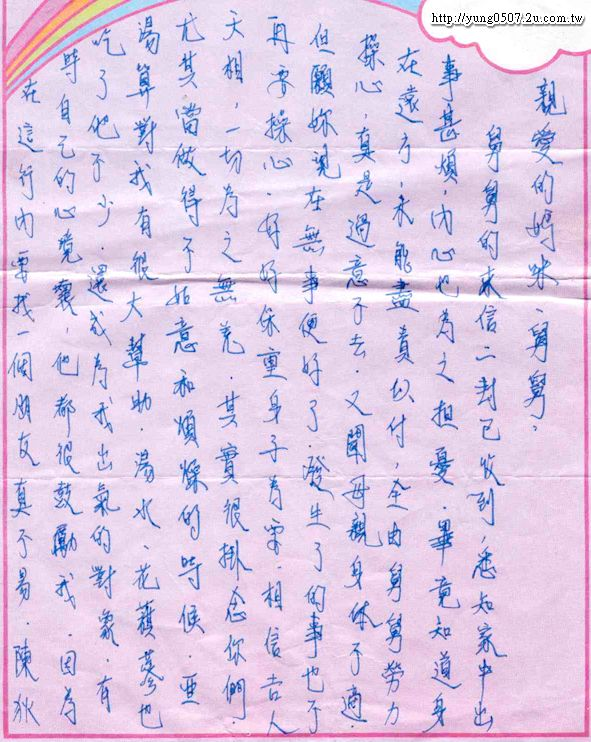
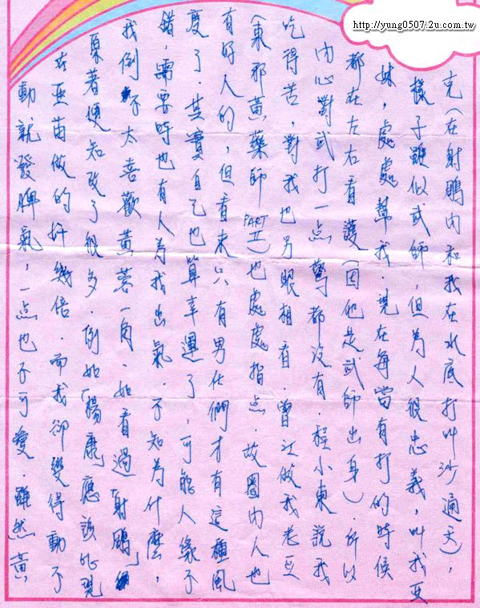
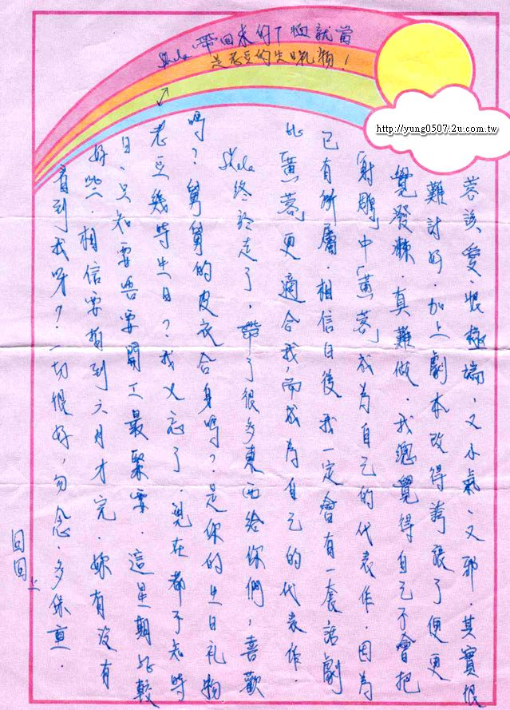

  

 

    这封信是2001-6月阿翁的小表弟Andrew寄给loulan与大家分享的。
    非常谢谢Barbara的舅舅和舅妈的提供！！

## 文字

亲爱的妈咪、舅舅：
舅舅的来信二封已收到，悉知家中出事甚烦，内心也为之担忧，毕竟知道身在远方，未能尽责以付，全由舅舅劳力操心，真是过意不去，又闻母亲身体不适，但愿你现在无事便好了，发生了的事也不再要操心，好好保重身子为要，相信吉人天相，一切为之无羌

其实很挂念你们，尤其当做得不如意和烦燥的时候，亚汤算对我有很大帮助，汤水、花旗参也吃了他不少，还成为我出气的对象，有时自己的心境坏，他都很鼓励我，因为在这行内要找一个朋友真不易，陈狄克（在射雕内和我在水底打，叫沙通天），样子虽似武师，但为人很忠义，叫我亚妹，处处帮我，现在每当有打的时候，都在左右看护（因他是武师出身），所以内心对武打一点惊都没有，程小东说我吃得苦，对我也另眼相看，曾江做我老豆（东邪西毒 PART2）也处处指点，故圈内人也有好人的，但看来只有男仕们才有这种风度了，其实自己也算幸运了，可能人缘不错，需要时也有人为我出气，不知为什么，我倒不太喜欢黄蓉一角，如看过“射雕”原著便知改了很多，例如“杨康”应该比现在亚苗做的奸几倍，而我却变得动不动就发脾气，一点也不可爱，虽然黄蓉该爱、恨极端，又小气、又邪，其实很难讨好，加上剧本改得夸张了便更觉泼辣，真难做，我总觉得自己不会把“射雕”中“黄蓉”成为自己的代表作，因为已有所属，相信日后我一定会有一套话剧比“黄蓉”更适合我，而成为自己的代表作。

Shela 终于走了，带了很多东西给你们，喜欢吗？舅舅的皮衣合身吗？是你的生日礼物，老豆几时生日？（Shela 带来的T恤就当是老豆的生日礼物！）我又忘了，现在都不知时日，只知要唔要开工最紧要，这星期比较好些，相信要拍到六月才完，你有没有看到我呀！一切很好，勿念，多保重。

    囡囡　上

## 原信件

 

 
