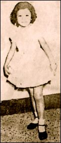

 

 

亲爱的棠叔叔、母亲：
昨夜，闻母亲的来电，实很开心，但听母亲说身体又感不适，我们都很忧虑和挂念，因为妳我相隔万里，的确难亲身服侍和安慰妳，而母亲对我们之挂心，更使身体难于康复，所以我们只有希望多多去信问候妳、祝福妳，此外，妳千万不要多思多虑，相信没有什么大问题的，正所谓忧思成疾病，只要你放开胸怀，好好地休息，不久便可康复，因为天主的慈爱，永远会给予我们帮助的，而我们亦会常常求主将享福、健康赐给妳的。

舅父说，妳现在若没有移民局消息的话，妳可叫医生证明，然后叫律师写信给移民局，说妳现在身体不适，希望妳的女儿能早日去到，在身旁服侍妳，相信这样也可以帮助手续的快速，那么妳便不须回港，因为妳还是需要好好地休息，这比妳烦心、坐飞机的不适好得多了，此外，我的确很想早日见到母亲妳啊！

总之，妳切不要难过，对于一切都要小心、镇定。因为妳有什么不适，我们大家都很不安，相信尤其是棠叔叔，他更为妳担心，所以妳一定要好好保重身子啊！

祝生活愉快　身体健康！

    女儿　囡囡上
    七四年三月廿七日

---------------------

*翁母是于七二年下嫁于廖锦棠后到英国，因移民手续问题，翁美玲约在七四年下半年才到英。在这两年期间，翁不断去信鼓励其母与生活进行顽强搏斗。十二年前她生命充满斗志、希望，但十二年后今天，她却在这“繁荣的社会，痛苦的民生中”逝去。*