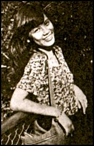

 

 

亲爱的妈咪、舅父：

很挂念你们，尤其妈咪的身体，但愿你不要太操劳，也不要太操心女儿我。今次的得失是早料到，一切内定。

此外，自己实只输了身材，至于现在的安排，实虽和你们商讨，无线有意和我谈讨（这星期五去见面），自己不是为了什么，但总觉得只有这样才能争口气和有机会表现自己，但不知你们的意见如何。此外，欲要在自己本行着意也不难，问心一句，我在港欲发展是比英国更有利的，问题是我的家，妈咪、舅舅等人都令我矛盾和迷惘，千言万语的感受相信你们应该明白，这口气我一定要争，希望你们能给我一个忠正的意见，多日来我都在思索。但这个转点太大了，你们一定要替我想想啊。

会计师信、录影带一一寄上，我心情太烦了，可否给些时间我去考虑呢？舅父可忙累了，真希望自己能令你们过些舒适的日子！这是句真心话，难道我不知道你们多辛苦？你们的给予我当然深受，给我些时间去报答你们！

这封信越写越乱，请早日回音，给我些意见，你们要多多保重，很挂念你们！

代问候 Shela

    女儿 囡囡上
    八二年七月十七日

(1)记得拿我的文凭
(2)叔母问及亚达，你要覆她