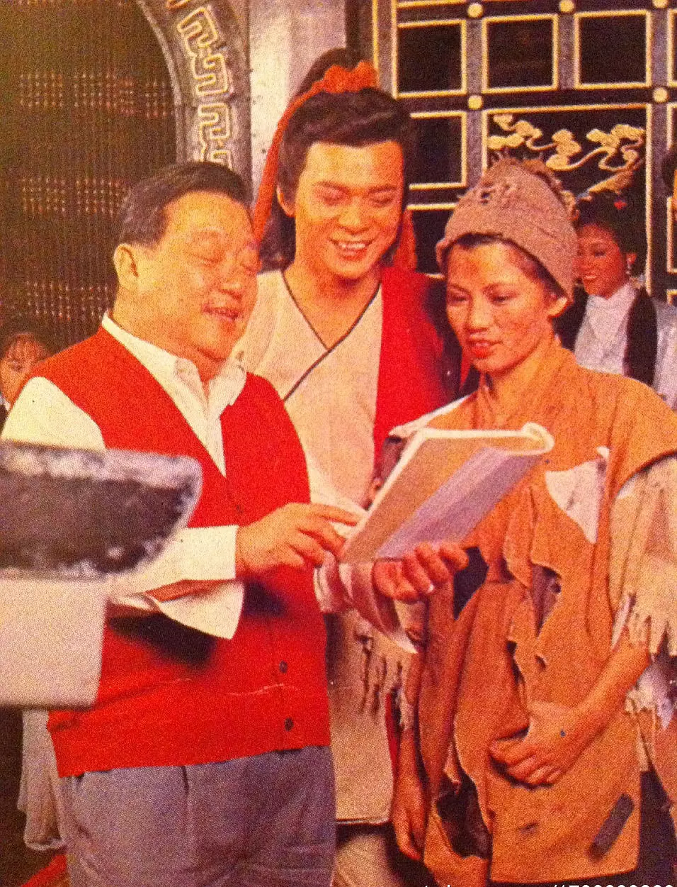

 

 

亲爱的妈咪、舅舅：

没有你们的来音，相信家中很忙，很快要放大假，你们打算去哪儿散心，香港的天气真是热得要命，有时三十多度时真不愿出街，但如要拍外景，也不由我说，可是他们都说我很幸运，是个食神每次外景不是天凉便去拍介绍食野，香港的名店名菜都被食过。不过，明天我要去试镜，可能被派做古装片，自己很希望试镜成功，因我恨做古装恨到发烧，这长剧是无线的（射雕英雄传），上次试的（青春剧）因形象问题，又不准拍，我做的（妇女新姿）的形象可把我弄死，因多是妇人看的片集，故要保持庄重和斯文，所以很多事都不能做，监制陈宝珠可算睇得我很重啊！明天的试镜对我本人来说是很重要的，是一条新路的发展，做司仪不是不好，而是自己比较喜欢做戏，一切尚好，请不用担心。

很久没有舅的来音，可好？你那儿的天气如何？很希望知道你的近况，很挂念你和妈咪，但愿一切安好，你和亚妹怎样？有没有新事件发生？灵芝来信二次，或许她见我没回信，竟写信去训练班的程老师，藉问候我，叫程老师多多帮忙我，其实我早已识程老师，并且每星期两夜去上堂，真耐她不来，我已回信客气答谢，你也当作不知此事算了，无谓开罪她，或许她是想知道我的近况如何啦！

两星期后有人去剑桥，我会托他带东西给你们，到时再通知你，妈咪的身体好些吗？一定要免得东烦西烦，妳和舅舅都要事事小心啊！下次我会寄些有关我的画报给你。请代问候老豆，老板仍有写信给我谈天，还画有一朵小花洒泪呢！说很不舍得我，但我们是好朋友，她真是大好人，迟些我要寄回二期粮钱给她。

祝　身心安康
（出外景时在公司车上写的，故字体很乱）

    女儿　囡囡上
    八二年八月十二日 寄出