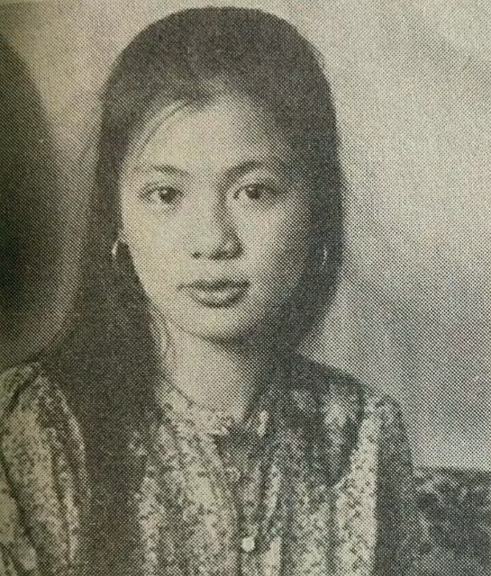

 

 

亲爱的妈咪：

不觉已渐入秋冬了，你要小心身体，不要着凉啊！记得到时到日去检查身体，对妳是有益的，我一切安好，请勿太为我操心。保重自己为要，舅有寄信和妳的照片来，妳仍然笑得很甜，朋友说妳像四十来岁呢！当然，靓妈咪出靓女！代母十七号生日，送了对耳环和封了红包给她，每个月她只肯收我三百蚊，故我常有空便请她饮茶或买些东西回家，因为亚牛搬出把房让给我，真不好意思白住，故多多少少也要给，但她不肯要多，说等我迟些赚到钱时给吧！

父亲来信说可能出年和妳一起回来一行，是吗？如果真的就好，因为你有伴同行是好的，闻说亚豆要去欧洲（未定），到时我会托他带东西给妳，一切一切你都不要挂心，我很担心你的，但这里一时放不下，真难做，正所谓“洗湿个头”或一句“身不由己”！一切听天吧！

    囡囡
    八二年十月十九日