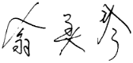

翁美玲个人档案
------------

| **中文名**  | **翁美玲** |
| :--------: | :--------|
| **英文名**     |  BARBARA YUNG  |
| **昵  称** | 囡囡 |
| **籍  贯**      |    安徽 |
| **中  学**      |    香港玫瑰港学校 |
| **毕业学校** | 剑桥大学修业2年 Foundation Course 2年预科 伦敦中央艺术和设计学院 Central School Of Art & Design 4年后拿到文学士学位 |
| **出生地点**    |  香港 |
| **出生日期**    | 1959年5月7日 |
| **仙逝日期**    | 1985年5月14日 |
| **终  年** | 26岁 |
| **生  肖** | 猪 |
| **星  座** | 金牛座 |
| **身  高** | 158cm |
| **体  重** | 45kg |
| **民族** | 汉 |
| **宗  教** | 天主教 |
| **职  业** | 演员、歌手、时装设计师 |
| **出道地点** | 香港 |
| **出道时间** | 1982年 |
| **家庭状况** | 私生女 |
| **曾居住地** | 九龙广播道 |
| **婚姻状况** | 未婚 |
| **爱  好** | 打羽球、聊天、吃零食 |
| **唯一客串电影** | 疯狂八三 |
| **最喜欢的歌星** | 甄妮、罗文 |
| **特殊爱好** | 爱喝可乐 |
| **喜欢做的事** | 设计美观质地优良的服装 |
| **最喜爱的十五** | 水果、海鲜 |
| **最喜爱的动物** | 狗、猫 |
| **最喜爱的颜色** | 白色、紫色 |
| **最喜爱的首饰** | 耳环 |
| **最难忘的第一次** | 拍古装剧十三妹 |
| **最尴尬的时刻** | 忘记台词 |
| **特别禁忌** | 百无禁忌 |
| **服装品味** | 简单 |
| **喜爱休闲** | 旅行 |
| **保值方法** | 买金 |
| **主演电视剧** | 十三妹、射雕英雄传、夹心人、决战玄武门、天师执位、 生锈轿王、楚留香之蝙蝠传奇、挑战、楚河汉界。 |
| **签  名** |  |

